Create Powerful Model Explanations with Logistic Regression
================
Jin Cui
2023-01-02

## Import Libraries

``` r
library(readxl)
```

    ## Warning: package 'readxl' was built under R version 4.2.2

``` r
library(data.table)
```

    ## Warning: package 'data.table' was built under R version 4.2.2

``` r
library(tidyverse)
```

    ## Warning: package 'tidyverse' was built under R version 4.2.2

    ## ── Attaching packages ─────────────────────────────────────── tidyverse 1.3.2 ──
    ## ✔ ggplot2 3.4.0      ✔ purrr   1.0.0 
    ## ✔ tibble  3.1.8      ✔ dplyr   1.0.10
    ## ✔ tidyr   1.2.1      ✔ stringr 1.5.0 
    ## ✔ readr   2.1.3      ✔ forcats 0.5.2

    ## Warning: package 'ggplot2' was built under R version 4.2.2

    ## Warning: package 'tibble' was built under R version 4.2.2

    ## Warning: package 'tidyr' was built under R version 4.2.2

    ## Warning: package 'readr' was built under R version 4.2.2

    ## Warning: package 'purrr' was built under R version 4.2.2

    ## Warning: package 'dplyr' was built under R version 4.2.2

    ## Warning: package 'stringr' was built under R version 4.2.2

    ## Warning: package 'forcats' was built under R version 4.2.2

    ## ── Conflicts ────────────────────────────────────────── tidyverse_conflicts() ──
    ## ✖ dplyr::between()   masks data.table::between()
    ## ✖ dplyr::filter()    masks stats::filter()
    ## ✖ dplyr::first()     masks data.table::first()
    ## ✖ dplyr::lag()       masks stats::lag()
    ## ✖ dplyr::last()      masks data.table::last()
    ## ✖ purrr::transpose() masks data.table::transpose()

``` r
library(dplyr)
library(ggplot2)
library(writexl)
```

    ## Warning: package 'writexl' was built under R version 4.2.2

``` r
library(ggpubr)
```

    ## Warning: package 'ggpubr' was built under R version 4.2.2

``` r
library(scales)
```

    ## Warning: package 'scales' was built under R version 4.2.2

    ## 
    ## Attaching package: 'scales'
    ## 
    ## The following object is masked from 'package:purrr':
    ## 
    ##     discard
    ## 
    ## The following object is masked from 'package:readr':
    ## 
    ##     col_factor

``` r
library(plotly)
```

    ## Warning: package 'plotly' was built under R version 4.2.2

    ## 
    ## Attaching package: 'plotly'
    ## 
    ## The following object is masked from 'package:ggplot2':
    ## 
    ##     last_plot
    ## 
    ## The following object is masked from 'package:stats':
    ## 
    ##     filter
    ## 
    ## The following object is masked from 'package:graphics':
    ## 
    ##     layout

``` r
library(officer)
```

    ## Warning: package 'officer' was built under R version 4.2.2

    ## 
    ## Attaching package: 'officer'
    ## 
    ## The following object is masked from 'package:readxl':
    ## 
    ##     read_xlsx

``` r
library(rvg)
```

    ## Warning: package 'rvg' was built under R version 4.2.2

``` r
## for model fitting
library(corrplot)
```

    ## Warning: package 'corrplot' was built under R version 4.2.2

    ## corrplot 0.92 loaded

``` r
library(DALEX)
```

    ## Warning: package 'DALEX' was built under R version 4.2.2

    ## Welcome to DALEX (version: 2.4.2).
    ## Find examples and detailed introduction at: http://ema.drwhy.ai/
    ## 
    ## 
    ## Attaching package: 'DALEX'
    ## 
    ## The following object is masked from 'package:dplyr':
    ## 
    ##     explain

``` r
library(car)
```

    ## Warning: package 'car' was built under R version 4.2.2

    ## Loading required package: carData

    ## Warning: package 'carData' was built under R version 4.2.2

    ## 
    ## Attaching package: 'car'
    ## 
    ## The following object is masked from 'package:dplyr':
    ## 
    ##     recode
    ## 
    ## The following object is masked from 'package:purrr':
    ## 
    ##     some

``` r
library(rpart)
```

    ## Warning: package 'rpart' was built under R version 4.2.2

``` r
library(rpart.plot)
```

    ## Warning: package 'rpart.plot' was built under R version 4.2.2

``` r
library(pROC)
```

    ## Warning: package 'pROC' was built under R version 4.2.2

    ## Type 'citation("pROC")' for a citation.
    ## 
    ## Attaching package: 'pROC'
    ## 
    ## The following objects are masked from 'package:stats':
    ## 
    ##     cov, smooth, var

``` r
library(pdp)
```

    ## Warning: package 'pdp' was built under R version 4.2.2

    ## 
    ## Attaching package: 'pdp'
    ## 
    ## The following object is masked from 'package:purrr':
    ## 
    ##     partial

``` r
library(caret)
```

    ## Warning: package 'caret' was built under R version 4.2.2

    ## Loading required package: lattice
    ## 
    ## Attaching package: 'caret'
    ## 
    ## The following object is masked from 'package:purrr':
    ## 
    ##     lift

``` r
library(randomForest)
```

    ## Warning: package 'randomForest' was built under R version 4.2.2

    ## randomForest 4.7-1.1
    ## Type rfNews() to see new features/changes/bug fixes.
    ## 
    ## Attaching package: 'randomForest'
    ## 
    ## The following object is masked from 'package:dplyr':
    ## 
    ##     combine
    ## 
    ## The following object is masked from 'package:ggplot2':
    ## 
    ##     margin

``` r
library(mlr)
```

    ## Warning: package 'mlr' was built under R version 4.2.2

    ## Loading required package: ParamHelpers

    ## Warning: package 'ParamHelpers' was built under R version 4.2.2

    ## Warning message: 'mlr' is in 'maintenance-only' mode since July 2019.
    ## Future development will only happen in 'mlr3'
    ## (<https://mlr3.mlr-org.com>). Due to the focus on 'mlr3' there might be
    ## uncaught bugs meanwhile in {mlr} - please consider switching.
    ## 
    ## Attaching package: 'mlr'
    ## 
    ## The following object is masked from 'package:caret':
    ## 
    ##     train

``` r
#library(xgboost)
#library(SHAPforxgboost)
```

# 1 - Data Import and EDA

## Set up and ingest data

``` r
data_raw <- read.csv('C:/Users/Jin/Documents/00_Machine_Learning/Logistic_Regression/Data/WA_Fn-UseC_-Telco-Customer-Churn.csv', header = TRUE)

#str(data_raw)
```

## Map categorical columns

``` r
setDT(data_raw)

data_raw[, SeniorCitizen_Flag := case_when(
                                 `SeniorCitizen` == 0 ~ "No",
                                 `SeniorCitizen` == 1 ~ "Yes" 
               
                                 )]


data_raw[, Churn_Flag := case_when(
                                 `Churn` == "Yes" ~ TRUE,
                                 `Churn` == "No" ~ FALSE 
               
                                 )]

data_raw$Bundle_Flag <- as.factor(ifelse (data_raw$PhoneService == "Yes" & data_raw$InternetService != "No" ,"Yes","No"))
```

## Apply filters

``` r
data_if    <- data_raw %>%
  filter(`Churn` == "No")

data_churn <- data_raw %>%
  filter(`Churn` == "Yes")
```

## Density Plots for Continuous Variables

### Monthly Charge

``` r
limit_prem <- 120

den_prem <- ggplot() + 
  geom_density(data = data_if, aes(x = data_if[["MonthlyCharges"]], y = ..count../sum(..count..)), fill = "#AAD8C8", alpha = 0.6, color = NA) +
  geom_density(data = data_churn, aes(x = data_churn[["MonthlyCharges"]], y = ..count../sum(..count..)), fill = "#2FB3B6", alpha = 0.6, color = NA) +
  
#scale_fill_manual(values = c("#AAD8C8", "#2FB3B6")) +
scale_x_continuous(labels = comma, breaks = seq(0, limit_prem, 10) 
  #                   , guide = guide_axis(n.dodge = 2)
                   ) +
scale_y_continuous(labels = percent, breaks=seq(0, 0.006, 0.001)) +

  theme(
        axis.title = element_blank(),
        legend.position = "bottom",
        legend.title = element_blank(),
        legend.text = element_text(size = 8)
        ) +
  labs(
       #x = "Full Lapse Indicator", y = "Exposure %", 
       title = "Distribution of Churn by Monthly Charges") +
  #guides(fill = guide_legend("Full Lapse Indicator")) +
  theme(panel.background = element_rect(fill = '#FFFFFF', color = "#FFFFFF"),
        panel.grid.major.x = element_blank(),
        #panel.grid.major.y = element_line(color = 'black', linetype = 'dotted'),
        panel.grid.minor = element_blank(),
        axis.ticks = element_blank() )


box_prem <- ggplot(data_raw, aes(x = as.factor(data_raw[["Churn"]]), y = data_raw[["MonthlyCharges"]], fill = as.factor(data_raw[["Churn"]]))) + 
  geom_boxplot(outlier.colour=NA, alpha = 0.6) +
  scale_y_continuous(labels = comma, breaks=seq(0, limit_prem, 10)
                     #, guide = guide_axis(n.dodge = 2)
                     ) +
  coord_cartesian(ylim = c(0, 200)) +
  theme(legend.title = element_blank(),
        legend.position = "none"
        ) +
  labs(x = "Churn") +
        #x = "Full Lapse Indicator", y = "API", 
        #title = "Distribution of Lapse by Premium") + 
  theme(panel.background = element_rect(fill = '#FFFFFF', color = "#FFFFFF"),
        panel.grid.major.x = element_blank(),
        panel.grid.major.y = element_blank(),
        panel.grid.minor = element_blank(),
        axis.ticks = element_blank(),
        axis.title.y = element_blank(),
        axis.title.x = element_text(size = 8),
        axis.text.x = element_text(size = 8)
        ) +
  scale_fill_manual(values=c("#AAD8C8", "#2FB3B6")) +
  stat_summary(fun = "mean", shape = 4, color = "#303E46")
  


ggr_prem_den <- ggarrange(den_prem, box_prem, widths = c(2.0, 0.7),
          #labels = c("A", "B", "C"),
          ncol = 2, nrow = 1)
```

    ## Warning: The dot-dot notation (`..count..`) was deprecated in ggplot2 3.4.0.
    ## ℹ Please use `after_stat(count)` instead.

    ## Warning: Removed 2 rows containing missing values (`geom_segment()`).

``` r
#dev.new()
print(ggr_prem_den)
```

<!-- -->

### Tenure (Months)

``` r
limit_tenure <- 75

den_tenure <- ggplot() + 
  geom_density(data = data_if, aes(x = data_if[["tenure"]], y = ..count../sum(..count..)), fill = "#AAD8C8", alpha = 0.6, color = NA) +
  geom_density(data = data_churn, aes(x = data_churn[["tenure"]], y = ..count../sum(..count..)), fill = "#2FB3B6", alpha = 0.6, color = NA) +
  
#scale_fill_manual(values = c("#AAD8C8", "#2FB3B6")) +
scale_x_continuous(labels = comma, breaks = seq(0, limit_tenure, 5) 
  #                   , guide = guide_axis(n.dodge = 2)
                   ) +
scale_y_continuous(labels = percent, breaks=seq(0, 0.006, 0.001)) +

  theme(
        axis.title = element_blank(),
        legend.position = "bottom",
        legend.title = element_blank(),
        legend.text = element_text(size = 8)
        ) +
  labs(
       #x = "Full Lapse Indicator", y = "Exposure %", 
       title = "Distribution of Churn by Tenure (Months)") +
  #guides(fill = guide_legend("Full Lapse Indicator")) +
  theme(panel.background = element_rect(fill = '#FFFFFF', color = "#FFFFFF"),
        panel.grid.major.x = element_blank(),
        #panel.grid.major.y = element_line(color = 'black', linetype = 'dotted'),
        panel.grid.minor = element_blank(),
        axis.ticks = element_blank() )


box_tenure <- ggplot(data_raw, aes(x = as.factor(data_raw[["Churn"]]), y = data_raw[["tenure"]], fill = as.factor(data_raw[["Churn"]]))) + 
  geom_boxplot(outlier.colour=NA, alpha = 0.6) +
  scale_y_continuous(labels = comma, breaks=seq(0, limit_tenure, 5)
                     #, guide = guide_axis(n.dodge = 2)
                     ) +
  coord_cartesian(ylim = c(0, 200)) +
  theme(legend.title = element_blank(),
        legend.position = "none"
        ) +
  labs(x = "Churn") +
        #x = "Full Lapse Indicator", y = "API", 
        #title = "Distribution of Lapse by Premium") + 
  theme(panel.background = element_rect(fill = '#FFFFFF', color = "#FFFFFF"),
        panel.grid.major.x = element_blank(),
        panel.grid.major.y = element_blank(),
        panel.grid.minor = element_blank(),
        axis.ticks = element_blank(),
        axis.title.y = element_blank(),
        axis.title.x = element_text(size = 8),
        axis.text.x = element_text(size = 8)
        ) +
  scale_fill_manual(values=c("#AAD8C8", "#2FB3B6")) +
  stat_summary(fun = "mean", shape = 4, color = "#303E46")
  


ggr_tenure_den <- ggarrange(den_tenure, box_tenure, widths = c(2.0, 0.7),
          #labels = c("A", "B", "C"),
          ncol = 2, nrow = 1)
```

    ## Warning: Removed 2 rows containing missing values (`geom_segment()`).

``` r
#dev.new()
print(ggr_tenure_den)
```

<!-- -->

## Histogram Plots for Categorical Variable (on same scale)

### Gender

``` r
labels_Gender <- c("Female", "Male")

Gender_hist <- ggplot() + 
  geom_bar(data = data_if, aes(x = as.factor(data_if[["gender"]]), y = ..count../sum(..count..)), fill = "#AAD8C8", alpha = 0.6) +
    geom_bar(data = data_churn, aes(x = as.factor(data_churn[["gender"]]), y = ..count../sum(..count..)), fill = "#2FB3B6", alpha = 0.6) +
  scale_y_continuous(labels = scales::percent, breaks = seq(0, 1, 0.1)) +
  scale_x_discrete(labels = labels_Gender) +
  #scale_fill_brewer(palette = "Pastel1") +
  #scale_fill_manual(values = c("#AAD8C8", "#2FB3B6")) +
  theme(axis.title = element_blank()) +
  theme(legend.title = element_blank(),
        legend.position = "none") +
  labs(title = "Churn Distribution by Gender") +
  theme(panel.background = element_rect(fill = '#FFFFFF', color = "#FFFFFF"),
        panel.grid.major.x = element_blank(),
        panel.grid.major.y = element_blank(),
        panel.grid.minor = element_blank(),
        axis.ticks = element_blank(),
        axis.title.y = element_blank(),
        axis.title.x = element_blank(),
        axis.text.x = element_text(size = 9))

print(Gender_hist)
```

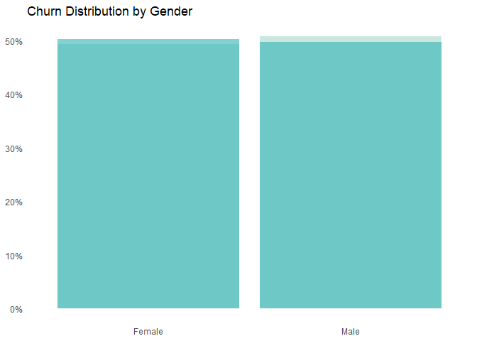<!-- -->

### Senior Citizen Flag

``` r
labels_SC <- c("Yes", "No")

SC_hist <- ggplot() + 
  geom_bar(data = data_if, aes(x = as.factor(data_if[["SeniorCitizen_Flag"]]), y = ..count../sum(..count..)), fill = "#AAD8C8", alpha = 0.6) +
    geom_bar(data = data_churn, aes(x = as.factor(data_churn[["SeniorCitizen_Flag"]]), y = ..count../sum(..count..)), fill = "#2FB3B6", alpha = 0.6) +
  scale_y_continuous(labels = scales::percent, breaks = seq(0, 1, 0.1)) +
  scale_x_discrete(labels = labels_SC) +
  #scale_fill_brewer(palette = "Pastel1") +
  #scale_fill_manual(values = c("#AAD8C8", "#2FB3B6")) +
  theme(axis.title = element_blank()) +
  theme(legend.title = element_blank(),
        legend.position = "none") +
  labs(title = "Churn Distribution by Senior Citizen Flag") +
  theme(panel.background = element_rect(fill = '#FFFFFF', color = "#FFFFFF"),
        panel.grid.major.x = element_blank(),
        panel.grid.major.y = element_blank(),
        panel.grid.minor = element_blank(),
        axis.ticks = element_blank(),
        axis.title.y = element_blank(),
        axis.title.x = element_blank(),
        axis.text.x = element_text(size = 9))

print(SC_hist)
```

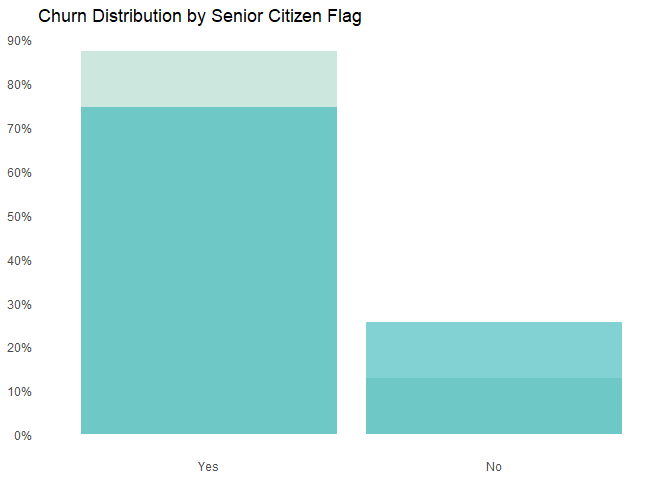<!-- -->

### Phone Service

``` r
labels_PS <- c("Yes", "No")

PS_hist <- ggplot() + 
  geom_bar(data = data_if, aes(x = as.factor(data_if[["PhoneService"]]), y = ..count../sum(..count..)), fill = "#AAD8C8", alpha = 0.6) +
    geom_bar(data = data_churn, aes(x = as.factor(data_churn[["PhoneService"]]), y = ..count../sum(..count..)), fill = "#2FB3B6", alpha = 0.6) +
  scale_y_continuous(labels = scales::percent, breaks = seq(0, 1, 0.1)) +
  scale_x_discrete(labels = labels_PS) +
  #scale_fill_brewer(palette = "Pastel1") +
  #scale_fill_manual(values = c("#AAD8C8", "#2FB3B6")) +
  theme(axis.title = element_blank()) +
  theme(legend.title = element_blank(),
        legend.position = "none") +
  labs(title = "Churn Distribution by Phone Service Flag") +
  theme(panel.background = element_rect(fill = '#FFFFFF', color = "#FFFFFF"),
        panel.grid.major.x = element_blank(),
        panel.grid.major.y = element_blank(),
        panel.grid.minor = element_blank(),
        axis.ticks = element_blank(),
        axis.title.y = element_blank(),
        axis.title.x = element_blank(),
        axis.text.x = element_text(size = 9))

print(PS_hist)
```

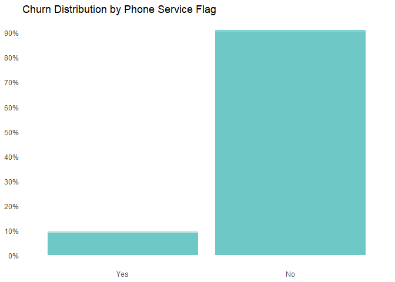<!-- -->

### Internet Service

``` r
labels_IS <- c("DSL", "Fiber optic", "No")

IS_hist <- ggplot() + 
  geom_bar(data = data_if, aes(x = as.factor(data_if[["InternetService"]]), y = ..count../sum(..count..)), fill = "#AAD8C8", alpha = 0.6) +
    geom_bar(data = data_churn, aes(x = as.factor(data_churn[["InternetService"]]), y = ..count../sum(..count..)), fill = "#2FB3B6", alpha = 0.6) +
  scale_y_continuous(labels = scales::percent, breaks = seq(0, 1, 0.1)) +
  scale_x_discrete(labels = labels_IS) +
  #scale_fill_brewer(palette = "Pastel1") +
  #scale_fill_manual(values = c("#AAD8C8", "#2FB3B6")) +
  theme(axis.title = element_blank()) +
  theme(legend.title = element_blank(),
        legend.position = "none") +
  labs(title = "Churn Distribution by Internet Service Flag") +
  theme(panel.background = element_rect(fill = '#FFFFFF', color = "#FFFFFF"),
        panel.grid.major.x = element_blank(),
        panel.grid.major.y = element_blank(),
        panel.grid.minor = element_blank(),
        axis.ticks = element_blank(),
        axis.title.y = element_blank(),
        axis.title.x = element_blank(),
        axis.text.x = element_text(size = 9))

print(IS_hist)
```

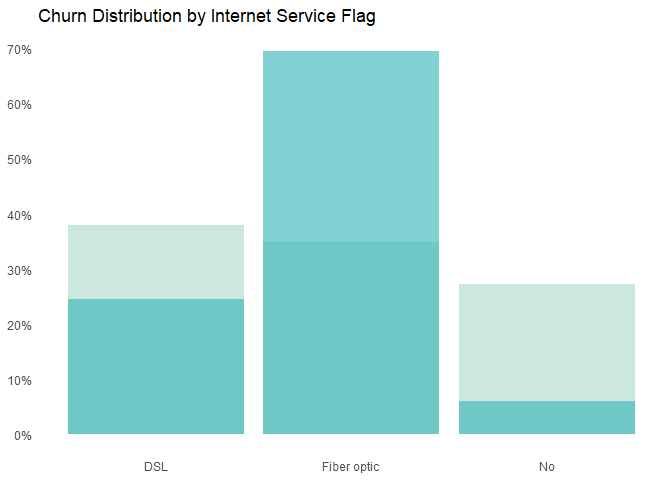<!-- -->

### Contract

``` r
labels_Contract <- c("Monthly", "One Year", "Two Year")

Contract_hist <- ggplot() + 
  geom_bar(data = data_if, aes(x = as.factor(data_if[["Contract"]]), y = ..count../sum(..count..)), fill = "#AAD8C8", alpha = 0.6) +
    geom_bar(data = data_churn, aes(x = as.factor(data_churn[["Contract"]]), y = ..count../sum(..count..)), fill = "#2FB3B6", alpha = 0.6) +
  scale_y_continuous(labels = scales::percent, breaks = seq(0, 1, 0.1)) +
  scale_x_discrete(labels = labels_Contract) +
  #scale_fill_brewer(palette = "Pastel1") +
  #scale_fill_manual(values = c("#AAD8C8", "#2FB3B6")) +
  theme(axis.title = element_blank()) +
  theme(legend.title = element_blank(),
        legend.position = "none") +
  labs(title = "Churn Distribution by Contract Type") +
  theme(panel.background = element_rect(fill = '#FFFFFF', color = "#FFFFFF"),
        panel.grid.major.x = element_blank(),
        panel.grid.major.y = element_blank(),
        panel.grid.minor = element_blank(),
        axis.ticks = element_blank(),
        axis.title.y = element_blank(),
        axis.title.x = element_blank(),
        axis.text.x = element_text(size = 9))

print(Contract_hist)
```

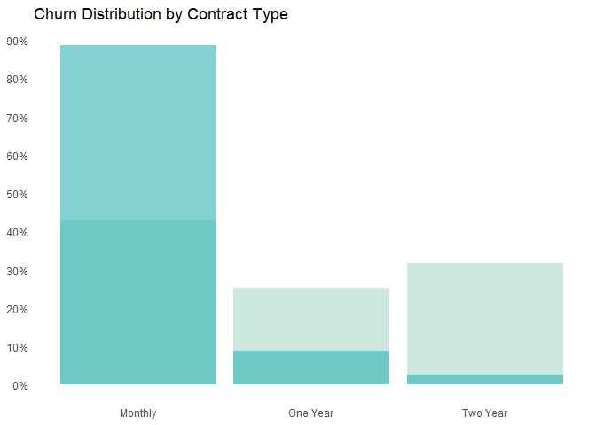<!-- -->

### Paperless Billing

``` r
labels_PB <- c("Yes", "No")

PB_hist <- ggplot() + 
  geom_bar(data = data_if, aes(x = as.factor(data_if[["PaperlessBilling"]]), y = ..count../sum(..count..)), fill = "#AAD8C8", alpha = 0.6) +
    geom_bar(data = data_churn, aes(x = as.factor(data_churn[["PaperlessBilling"]]), y = ..count../sum(..count..)), fill = "#2FB3B6", alpha = 0.6) +
  scale_y_continuous(labels = scales::percent, breaks = seq(0, 1, 0.1)) +
  scale_x_discrete(labels = labels_PB) +
  #scale_fill_brewer(palette = "Pastel1") +
  #scale_fill_manual(values = c("#AAD8C8", "#2FB3B6")) +
  theme(axis.title = element_blank()) +
  theme(legend.title = element_blank(),
        legend.position = "none") +
  labs(title = "Churn Distribution by Paperless Billing Flag") +
  theme(panel.background = element_rect(fill = '#FFFFFF', color = "#FFFFFF"),
        panel.grid.major.x = element_blank(),
        panel.grid.major.y = element_blank(),
        panel.grid.minor = element_blank(),
        axis.ticks = element_blank(),
        axis.title.y = element_blank(),
        axis.title.x = element_blank(),
        axis.text.x = element_text(size = 9))

print(PB_hist)
```

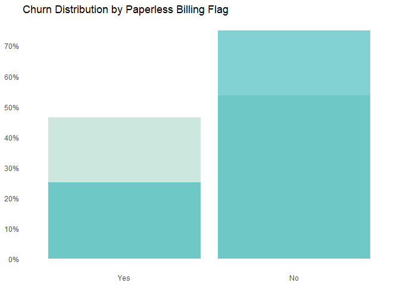<!-- -->

### Payment Method

``` r
labels_PM <- c("Bank Transfer", "Credit Card", "Electronic Cheque", "Mailed Cheque")

PM_hist <- ggplot() + 
  geom_bar(data = data_if, aes(x = as.factor(data_if[["PaymentMethod"]]), y = ..count../sum(..count..)), fill = "#AAD8C8", alpha = 0.6) +
    geom_bar(data = data_churn, aes(x = as.factor(data_churn[["PaymentMethod"]]), y = ..count../sum(..count..)), fill = "#2FB3B6", alpha = 0.6) +
  scale_y_continuous(labels = scales::percent, breaks = seq(0, 1, 0.1)) +
  scale_x_discrete(labels = labels_PM, guide = guide_axis(n.dodge = 2)) +
  #scale_fill_brewer(palette = "Pastel1") +
  #scale_fill_manual(values = c("#AAD8C8", "#2FB3B6")) +
  theme(axis.title = element_blank()) +
  theme(legend.title = element_blank(),
        legend.position = "none") +
  labs(title = "Churn Distribution by Payment Method") +
  theme(panel.background = element_rect(fill = '#FFFFFF', color = "#FFFFFF"),
        panel.grid.major.x = element_blank(),
        panel.grid.major.y = element_blank(),
        panel.grid.minor = element_blank(),
        axis.ticks = element_blank(),
        axis.title.y = element_blank(),
        axis.title.x = element_blank(),
        axis.text.x = element_text(size = 9))

print(PM_hist)
```

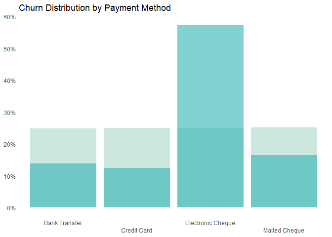<!-- -->

## Stat2D plot

### Monthly Charges by Contract Type STAT2D plot

``` r
labels_y_contract_type <- c("Month-to-Month", 
                           "One Year", 
                           "Two Year")

Stat2D_MC_contract <- ggplot(data_if, aes(x = `MonthlyCharges`, y = `Contract`)) +

  stat_bin2d(bins = 20) +
  scale_fill_gradient(low = "#EFEFD2", high = "#F15A24", limits = c(0, 1000)) +
 scale_x_continuous(labels = comma, breaks=seq(0, 120, 10)
                     ,guide = guide_axis(n.dodge = 2)
                     ) +
 scale_y_discrete(labels = labels_y_contract_type) +

  theme(axis.title = element_blank(),
        legend.position = "right",
        legend.title = element_blank(),
        legend.text = element_text(size = 8)
        ) +
  labs(title = "Distribution of Contract Type by Monthly Charges") +
  #guides(fill = guide_legend(title = "Full Lapse")) +
  theme(panel.background = element_rect(fill = '#FFFFFF', color = "#FFFFFF"),
        panel.grid.major.x = element_blank(),
        #panel.grid.major.y = element_line(color = 'black', linetype = 'dotted'),
        panel.grid.major.y = element_blank(),
        panel.grid.minor = element_blank(),
        #axis.ticks = element_blank() 
        ) 

print(Stat2D_MC_contract)
```

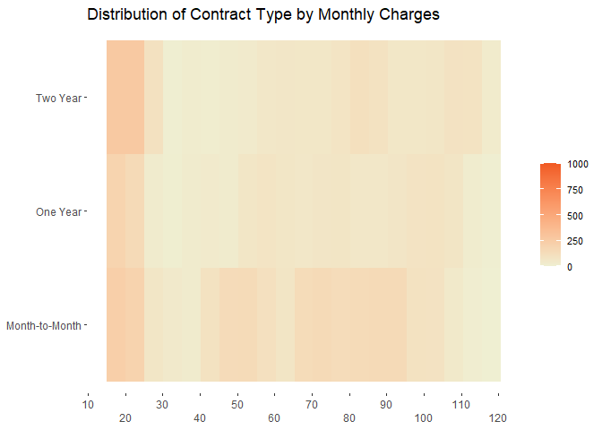<!-- -->

### Monthly Charges by Payment Method STAT2D plot

``` r
labels_y_payment_method <- c("Bank Transfer", 
                           "Credit Card", 
                           "Electronic Cheque",
                           "Mailed Cheque")

Stat2D_MC_PM <- ggplot(data_if, aes(x = `MonthlyCharges`, y = `PaymentMethod`)) +

  stat_bin2d(bins = 20) +
  scale_fill_gradient(low = "#EFEFD2", high = "#F15A24", limits = c(0, 500)) +
 scale_x_continuous(labels = comma, breaks=seq(0, 120, 10)
                     ,guide = guide_axis(n.dodge = 2)
                     ) +
 scale_y_discrete(labels = labels_y_payment_method) +

  theme(axis.title = element_blank(),
        legend.position = "right",
        legend.title = element_blank(),
        legend.text = element_text(size = 8)
        ) +
  labs(title = "Distribution of Payment Method by Monthly Charges") +
  #guides(fill = guide_legend(title = "Full Lapse")) +
  theme(panel.background = element_rect(fill = '#FFFFFF', color = "#FFFFFF"),
        panel.grid.major.x = element_blank(),
        #panel.grid.major.y = element_line(color = 'black', linetype = 'dotted'),
        panel.grid.major.y = element_blank(),
        panel.grid.minor = element_blank(),
        #axis.ticks = element_blank() 
        ) 

print(Stat2D_MC_PM)
```

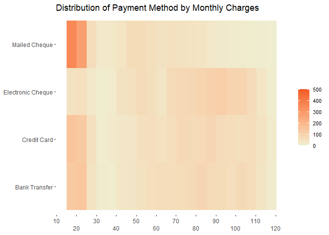<!-- -->

# 2 - GLM Fit

### Train Test Split

``` r
y = data_raw$Churn_Flag


set.seed(268)

sample_size <- floor(0.7 * nrow(data_raw))
sample_indi <- sample(seq_len(nrow(data_raw)), size = sample_size)

d_train <- data_raw[sample_indi,]
d_test <- data_raw[-sample_indi,]
y_train <- y[sample_indi]
y_test <- y[-sample_indi]
```

### GLM Fit 1 - Base

``` r
glm_1 <- glm(Churn_Flag ~
                  
  tenure
+ MonthlyCharges

+ relevel(factor(gender), ref = "Female")
+ relevel(factor(SeniorCitizen_Flag), ref = "Yes")
+ relevel(factor(PhoneService), ref = "No")
+ relevel(factor(InternetService), ref = "DSL")
+ relevel(factor(Contract), ref = "Month-to-month")
+ relevel(factor(PaperlessBilling), ref = "No")
+ relevel(factor(PaymentMethod), ref = "Bank transfer (automatic)")

#+ Partner
#+ Dependents
#+ MultipleLines
#+ OnlineSecurity   
#+ OnlineBackup 
#+ DeviceProtection
#+  TechSupport
#+  StreamingTV
#+  StreamingMovies


, data = d_train
, family = binomial("logit")

)


summary(glm_1)
```

    ## 
    ## Call:
    ## glm(formula = Churn_Flag ~ tenure + MonthlyCharges + relevel(factor(gender), 
    ##     ref = "Female") + relevel(factor(SeniorCitizen_Flag), ref = "Yes") + 
    ##     relevel(factor(PhoneService), ref = "No") + relevel(factor(InternetService), 
    ##     ref = "DSL") + relevel(factor(Contract), ref = "Month-to-month") + 
    ##     relevel(factor(PaperlessBilling), ref = "No") + relevel(factor(PaymentMethod), 
    ##     ref = "Bank transfer (automatic)"), family = binomial("logit"), 
    ##     data = d_train)
    ## 
    ## Deviance Residuals: 
    ##     Min       1Q   Median       3Q      Max  
    ## -1.8074  -0.6732  -0.2887   0.7397   3.3332  
    ## 
    ## Coefficients:
    ##                                                                                           Estimate
    ## (Intercept)                                                                              -0.608125
    ## tenure                                                                                   -0.035726
    ## MonthlyCharges                                                                            0.015318
    ## relevel(factor(gender), ref = "Female")Male                                               0.036356
    ## relevel(factor(SeniorCitizen_Flag), ref = "Yes")No                                       -0.277080
    ## relevel(factor(PhoneService), ref = "No")Yes                                             -0.721839
    ## relevel(factor(InternetService), ref = "DSL")Fiber optic                                  0.631007
    ## relevel(factor(InternetService), ref = "DSL")No                                          -0.395739
    ## relevel(factor(Contract), ref = "Month-to-month")One year                                -0.814943
    ## relevel(factor(Contract), ref = "Month-to-month")Two year                                -1.730075
    ## relevel(factor(PaperlessBilling), ref = "No")Yes                                          0.359425
    ## relevel(factor(PaymentMethod), ref = "Bank transfer (automatic)")Credit card (automatic) -0.003434
    ## relevel(factor(PaymentMethod), ref = "Bank transfer (automatic)")Electronic check         0.405856
    ## relevel(factor(PaymentMethod), ref = "Bank transfer (automatic)")Mailed check            -0.043129
    ##                                                                                          Std. Error
    ## (Intercept)                                                                                0.235657
    ## tenure                                                                                     0.002647
    ## MonthlyCharges                                                                             0.004223
    ## relevel(factor(gender), ref = "Female")Male                                                0.077279
    ## relevel(factor(SeniorCitizen_Flag), ref = "Yes")No                                         0.098219
    ## relevel(factor(PhoneService), ref = "No")Yes                                               0.168187
    ## relevel(factor(InternetService), ref = "DSL")Fiber optic                                   0.156735
    ## relevel(factor(InternetService), ref = "DSL")No                                            0.220695
    ## relevel(factor(Contract), ref = "Month-to-month")One year                                  0.125837
    ## relevel(factor(Contract), ref = "Month-to-month")Two year                                  0.213608
    ## relevel(factor(PaperlessBilling), ref = "No")Yes                                           0.088590
    ## relevel(factor(PaymentMethod), ref = "Bank transfer (automatic)")Credit card (automatic)   0.136086
    ## relevel(factor(PaymentMethod), ref = "Bank transfer (automatic)")Electronic check          0.111441
    ## relevel(factor(PaymentMethod), ref = "Bank transfer (automatic)")Mailed check              0.135447
    ##                                                                                          z value
    ## (Intercept)                                                                               -2.581
    ## tenure                                                                                   -13.499
    ## MonthlyCharges                                                                             3.627
    ## relevel(factor(gender), ref = "Female")Male                                                0.470
    ## relevel(factor(SeniorCitizen_Flag), ref = "Yes")No                                        -2.821
    ## relevel(factor(PhoneService), ref = "No")Yes                                              -4.292
    ## relevel(factor(InternetService), ref = "DSL")Fiber optic                                   4.026
    ## relevel(factor(InternetService), ref = "DSL")No                                           -1.793
    ## relevel(factor(Contract), ref = "Month-to-month")One year                                 -6.476
    ## relevel(factor(Contract), ref = "Month-to-month")Two year                                 -8.099
    ## relevel(factor(PaperlessBilling), ref = "No")Yes                                           4.057
    ## relevel(factor(PaymentMethod), ref = "Bank transfer (automatic)")Credit card (automatic)  -0.025
    ## relevel(factor(PaymentMethod), ref = "Bank transfer (automatic)")Electronic check          3.642
    ## relevel(factor(PaymentMethod), ref = "Bank transfer (automatic)")Mailed check             -0.318
    ##                                                                                          Pr(>|z|)
    ## (Intercept)                                                                              0.009864
    ## tenure                                                                                    < 2e-16
    ## MonthlyCharges                                                                           0.000286
    ## relevel(factor(gender), ref = "Female")Male                                              0.638027
    ## relevel(factor(SeniorCitizen_Flag), ref = "Yes")No                                       0.004787
    ## relevel(factor(PhoneService), ref = "No")Yes                                             1.77e-05
    ## relevel(factor(InternetService), ref = "DSL")Fiber optic                                 5.67e-05
    ## relevel(factor(InternetService), ref = "DSL")No                                          0.072949
    ## relevel(factor(Contract), ref = "Month-to-month")One year                                9.41e-11
    ## relevel(factor(Contract), ref = "Month-to-month")Two year                                5.53e-16
    ## relevel(factor(PaperlessBilling), ref = "No")Yes                                         4.97e-05
    ## relevel(factor(PaymentMethod), ref = "Bank transfer (automatic)")Credit card (automatic) 0.979870
    ## relevel(factor(PaymentMethod), ref = "Bank transfer (automatic)")Electronic check        0.000271
    ## relevel(factor(PaymentMethod), ref = "Bank transfer (automatic)")Mailed check            0.750165
    ##                                                                                             
    ## (Intercept)                                                                              ** 
    ## tenure                                                                                   ***
    ## MonthlyCharges                                                                           ***
    ## relevel(factor(gender), ref = "Female")Male                                                 
    ## relevel(factor(SeniorCitizen_Flag), ref = "Yes")No                                       ** 
    ## relevel(factor(PhoneService), ref = "No")Yes                                             ***
    ## relevel(factor(InternetService), ref = "DSL")Fiber optic                                 ***
    ## relevel(factor(InternetService), ref = "DSL")No                                          .  
    ## relevel(factor(Contract), ref = "Month-to-month")One year                                ***
    ## relevel(factor(Contract), ref = "Month-to-month")Two year                                ***
    ## relevel(factor(PaperlessBilling), ref = "No")Yes                                         ***
    ## relevel(factor(PaymentMethod), ref = "Bank transfer (automatic)")Credit card (automatic)    
    ## relevel(factor(PaymentMethod), ref = "Bank transfer (automatic)")Electronic check        ***
    ## relevel(factor(PaymentMethod), ref = "Bank transfer (automatic)")Mailed check               
    ## ---
    ## Signif. codes:  0 '***' 0.001 '**' 0.01 '*' 0.05 '.' 0.1 ' ' 1
    ## 
    ## (Dispersion parameter for binomial family taken to be 1)
    ## 
    ##     Null deviance: 5688.1  on 4929  degrees of freedom
    ## Residual deviance: 4103.9  on 4916  degrees of freedom
    ## AIC: 4131.9
    ## 
    ## Number of Fisher Scoring iterations: 6

``` r
#write.csv(summary(glm_1)$coefficients, "summary_glm_1_telco_churn.csv")
```

### Model Diagnostics

``` r
p_train_glm_1 <- predict(glm_1, d_train, type = "response")
p_test_glm_1  <- predict(glm_1, d_test, type = "response")

mean(y_train)
```

    ## [1] 0.2636917

``` r
mean(p_train_glm_1)
```

    ## [1] 0.2636917

``` r
mean(y_test)
```

    ## [1] 0.2692854

``` r
mean(p_test_glm_1)
```

    ## [1] 0.2654072

``` r
thresh <- quantile(p_train_glm_1, 1 - mean(y_train))
#thresh_LS

confusionMatrix(factor(p_train_glm_1 > thresh), factor(y_train), positive = "TRUE")
```

    ## Confusion Matrix and Statistics
    ## 
    ##           Reference
    ## Prediction FALSE TRUE
    ##      FALSE  3132  498
    ##      TRUE    498  802
    ##                                           
    ##                Accuracy : 0.798           
    ##                  95% CI : (0.7865, 0.8091)
    ##     No Information Rate : 0.7363          
    ##     P-Value [Acc > NIR] : <2e-16          
    ##                                           
    ##                   Kappa : 0.4797          
    ##                                           
    ##  Mcnemar's Test P-Value : 1               
    ##                                           
    ##             Sensitivity : 0.6169          
    ##             Specificity : 0.8628          
    ##          Pos Pred Value : 0.6169          
    ##          Neg Pred Value : 0.8628          
    ##              Prevalence : 0.2637          
    ##          Detection Rate : 0.1627          
    ##    Detection Prevalence : 0.2637          
    ##       Balanced Accuracy : 0.7399          
    ##                                           
    ##        'Positive' Class : TRUE            
    ## 

``` r
confusionMatrix(factor(p_test_glm_1 > thresh), factor(y_test), positive = "TRUE")
```

    ## Confusion Matrix and Statistics
    ## 
    ##           Reference
    ## Prediction FALSE TRUE
    ##      FALSE  1325  226
    ##      TRUE    219  343
    ##                                           
    ##                Accuracy : 0.7894          
    ##                  95% CI : (0.7714, 0.8066)
    ##     No Information Rate : 0.7307          
    ##     P-Value [Acc > NIR] : 2.653e-10       
    ##                                           
    ##                   Kappa : 0.4628          
    ##                                           
    ##  Mcnemar's Test P-Value : 0.7761          
    ##                                           
    ##             Sensitivity : 0.6028          
    ##             Specificity : 0.8582          
    ##          Pos Pred Value : 0.6103          
    ##          Neg Pred Value : 0.8543          
    ##              Prevalence : 0.2693          
    ##          Detection Rate : 0.1623          
    ##    Detection Prevalence : 0.2660          
    ##       Balanced Accuracy : 0.7305          
    ##                                           
    ##        'Positive' Class : TRUE            
    ## 

``` r
roc(y_train, p_train_glm_1, plot = T, ci = T)
```

    ## Setting levels: control = FALSE, case = TRUE

    ## Setting direction: controls < cases

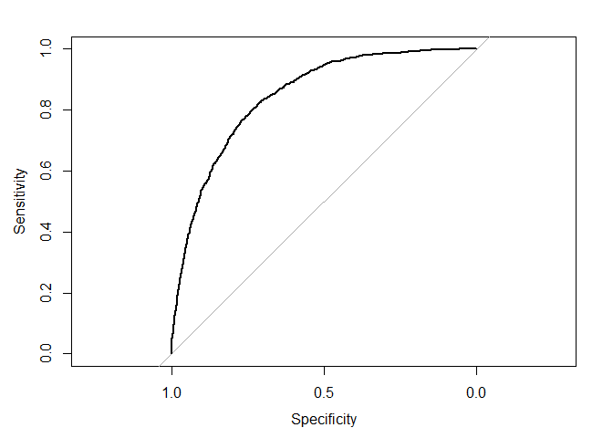<!-- -->

    ## 
    ## Call:
    ## roc.default(response = y_train, predictor = p_train_glm_1, ci = T,     plot = T)
    ## 
    ## Data: p_train_glm_1 in 3630 controls (y_train FALSE) < 1300 cases (y_train TRUE).
    ## Area under the curve: 0.8448
    ## 95% CI: 0.8332-0.8564 (DeLong)

``` r
roc(y_test, p_test_glm_1, plot = T, ci = T)
```

    ## Setting levels: control = FALSE, case = TRUE
    ## Setting direction: controls < cases

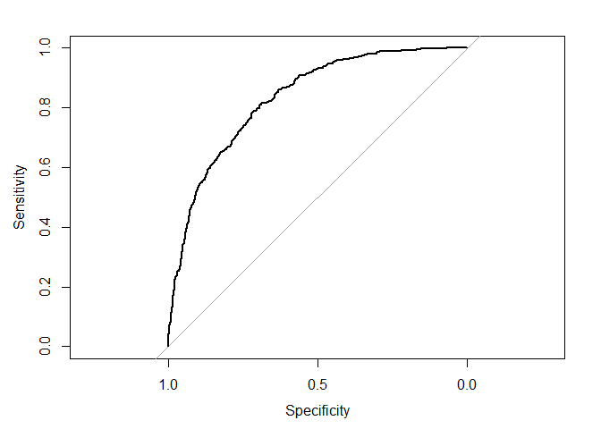<!-- -->

    ## 
    ## Call:
    ## roc.default(response = y_test, predictor = p_test_glm_1, ci = T,     plot = T)
    ## 
    ## Data: p_test_glm_1 in 1544 controls (y_test FALSE) < 569 cases (y_test TRUE).
    ## Area under the curve: 0.8303
    ## 95% CI: 0.8118-0.8488 (DeLong)
